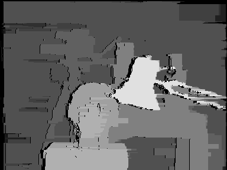
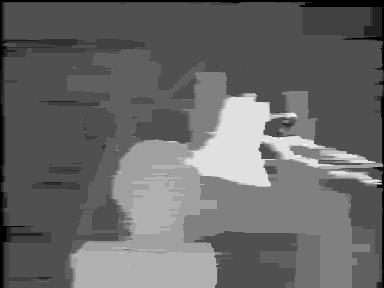

# Dynamic Programming for Stereo Matching (Left-Right Axes)
A Matlab implementation of Dynamic Programming for stereo matching. The DSI is constructed using left and right scanlines as axes. Provides vertical smoothness by trying to keep the current path close to the former path using an additional discontinuity cost.

## Input Image
The Tsukuba stereo image that used as input.

   

## Output Image (With Occlusions)
The disparity map that created at the output.

   

## Output Image (Without Occlusions)
The disparity map without occluded pixels.

   

